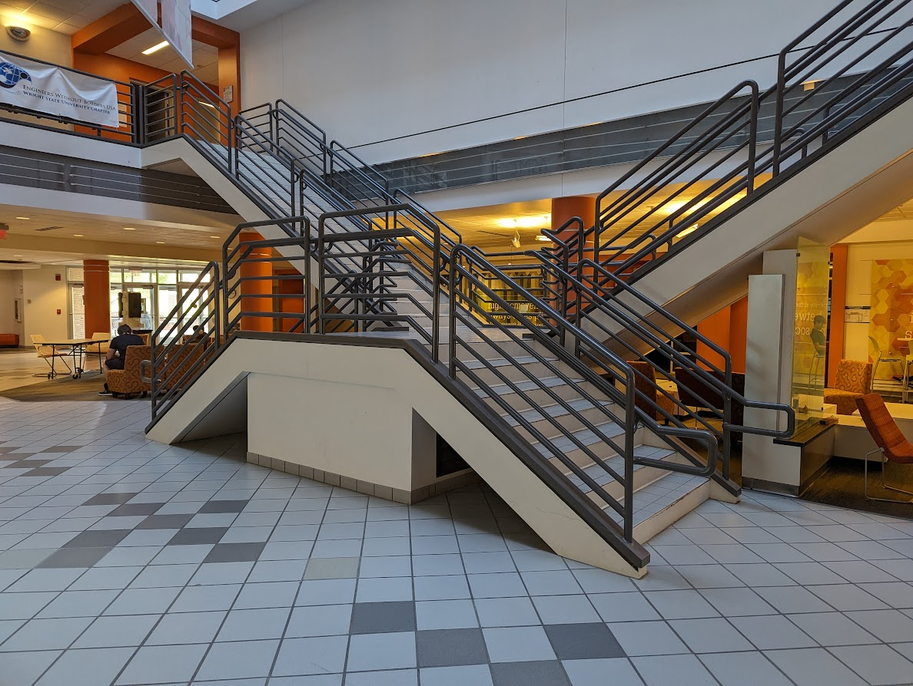

<!-- _class: title -->

# Wright State University ACM Student Chapter

Structured, hands-on computing experiences at Wright State

Dayton, Ohio 
ACM Midwest Chapters Meeting

<!--
Speaker notes:
Open with energy. This slide should feel less like an administrative title page and more like an invitation into the chapter's work. The staircase image is intentional: it connects the chapter identity to a visible student project in the main engineering building. Keep the opening concise, then move the chapter details to the next slide.
-->

---

<!-- _class: identity -->

## Who We Are

<dl class="identity-list">
  <dt>Chapter</dt>
  <dd>Wright State University ACM Student Chapter</dd>

  <dt>Location</dt>
  <dd>Dayton, Ohio</dd>

  <dt>Contact</dt>
  <dd><a href="mailto:acm@wright.edu">acm@wright.edu</a></dd>

  <dt>President</dt>
  <dd>Adrien Abbey</dd>

  <dt>Treasurer</dt>
  <dd>Shepard Garrett</dd>

  <dt>Faculty Advisor</dt>
  <dd>Kayleigh Duncan</dd>
</dl>

**A small chapter using ACM as a platform for practical, student-centered technical experiences.**

<!--
Speaker notes:
This slide covers the required administrative information without crowding the title slide. If the founding year is not confirmed before the meeting, omit it. Briefly explain that the chapter is small by officer count, but it reaches a broader student audience through workshops, contests, and long-running projects.
-->

---

## Our Chapter Model

**We use ACM as a platform for hands-on computing experiences.**

Our strongest events have three things in common:

1. **A clear technical goal**
2. **Guided support from experienced students or staff**
3. **A visible outcome students can take pride in**

Examples include the annual programming contest, homelab workshop series, Linux Install Nights, Piano Staircase, and line-following robotics workshop.

<!--
Speaker notes:
This slide combines the earlier “Our Chapter Model” and “Engagement Through Structure” slides. The main point is that the chapter is not built around ordinary meetings alone. Students respond better when an event has structure, mentorship, and a tangible result. This framing sets up the rest of the presentation as a coherent model rather than a simple list of activities.
-->

---

## Homelab Workshop Series

A semester-long workshop introducing students to practical self-hosting and virtualization.

**Topics included:**

- Proxmox installation and configuration
- ZFS-backed storage and VM snapshots
- Ubuntu Cloud VM templates
- CloudInit-based provisioning
- self-hosted services and server administration

**Outcome:** several students completed the series with working Proxmox systems they continued using afterward.

<!--
Speaker notes:
This was one of our clearest examples of durable learning. Some students came in with personal hardware, while others used older laptops or available systems. The strongest outcome was that students continued using what they built after the workshop ended. One student inherited the server used for demonstrations and still hosts services on it. Another student uses his system to host a game server for an RPG group. The regret is that there was not enough time for a deeper Ansible section, but the follow-up repositories helped students continue learning.
-->

---

## Annual Programming Contest

One of our strongest annual traditions: a timed, team-based programming challenge.

**Contest format:**

- teams share one computer
- no Internet access during contest play
- common languages: C, C++, Java, Python
- problems reward both coding and strategy

**Why it works:**

- typically draws 50+ students
- encourages collaboration under constraints
- creates a pathway to regional programming contests
- supported by sponsors such as Reynolds & Reynolds

<!--
Speaker notes:
Describe this as a major annual engagement event. The format encourages real teamwork: one student may be coding while others reason through problems, review edge cases, and decide which problem to attempt next. The no-Internet rule keeps the focus on problem solving rather than searching. Keep regional contest wording cautious unless confirmed. If confirmed later, this can be updated to name ICPC or the specific regional contest.
-->

---

## Piano Staircase

**Our signature long-term project.**

Goal: turn the Russ Engineering atrium staircase into an interactive system with sensors, sound, and lights.

**Why it matters:**

- gives students a real interdisciplinary engineering project
- involves computer science, computer engineering, electrical engineering, and mechanical design
- creates something visible in a central engineering space
- gives students work they can attach their names to

**Current direction:** research phase completed; Fall goal is an initial 3-step prototype.

<!--
Speaker notes:
This should be the most memorable project in the talk. Explain that Russ Engineering is the main engineering building at Wright State, so the staircase is in a central place that students, visitors, and prospective families regularly see. The project is not just about making stairs play sounds. It is about students working on a real system: sensors, audio, lights, physical installation, documentation, safety, and project planning. Mention Students First Fund support if that remains appropriate to state publicly.
-->

---

## Linux Install Nights

A beginner-accessible event for students interested in trying Linux.

**What we provide:**

- guided installation help
- spare devices for students without suitable hardware
- beginner-friendly explanations
- designated mentors for support

**Lesson learned:** installation events need clear safety expectations, especially around backups, data loss, and who is authorized to help.

<!--
Speaker notes:
Keep this mature and process-focused. Do not dwell on chaotic details. The important lesson is that seemingly simple events can become risky if students are modifying personal computers. We learned to be more explicit: back up files, understand that installation can wipe data, and rely on clearly designated mentors. This reinforces the broader theme that structure improves student outcomes.
-->

---

## Line-Following Robotics Workshop

A five-week robotics workshop built around Raspberry Pi Pico robot kits.

**Students learn:**

- embedded programming
- reflective IR sensing
- motor control
- feedback behavior
- real-time decision-making

The final session focuses on performance analysis and optional demonstration rather than pure competition.

<!--
Speaker notes:
This workshop is intentionally approachable. Students are guided from kits to motors, then sensors, then control behavior, then performance analysis. The goal is not only to see which robot is fastest. The more important goal is for students to compare design choices and understand why different robots behave differently. This also gives computer engineering students a hands-on project path related to robotics and physical computing.
-->

---

## Legacy and Future Goals

**Chapter legacy:**

- ACM has supported special-interest technical communities
- former National Cyber League group regularly placed in the top 10% nationally
- past efforts continue to shape current workshop design

**Next goals:**

- complete Piano Staircase Phase 1
- increase active student participation
- develop future project and chapter leaders
- continue building reusable workshop materials

<!--
Speaker notes:
Use this slide to connect past, present, and future. The NCL point should be softened or removed if the wording is not confirmed before presenting. The main future concern is sustainability: more active students, more leaders, and workshops that can survive beyond one officer. Emphasize leadership growth as much as technical output.
-->

---

<!-- _class: closing -->

# Collaboration & Contact

We are interested in sharing what has worked for us and learning how other chapters build durable student engagement.

**We would enjoy discussing:**

- practical workshop design
- student engagement strategies
- programming contests
- long-running technical projects
- leadership continuity

<strong>Contact:</strong> <a href="mailto:acm@wright.edu">acm@wright.edu</a> 
<strong>Chapter:</strong> Wright State University ACM Student Chapter

<!--
Speaker notes:
Close with a balanced invitation. The tone should not be needy or self-promotional. The message is that we are building a practical model and would like to compare approaches with other chapters. Emphasize mutual exchange: we can share materials and lessons learned, and we also want to learn from chapters with different strengths.
-->